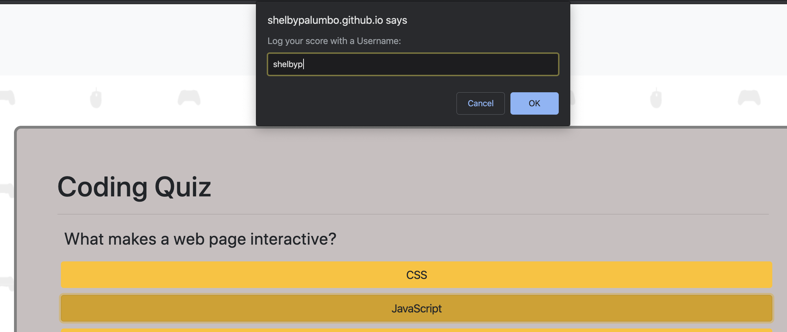
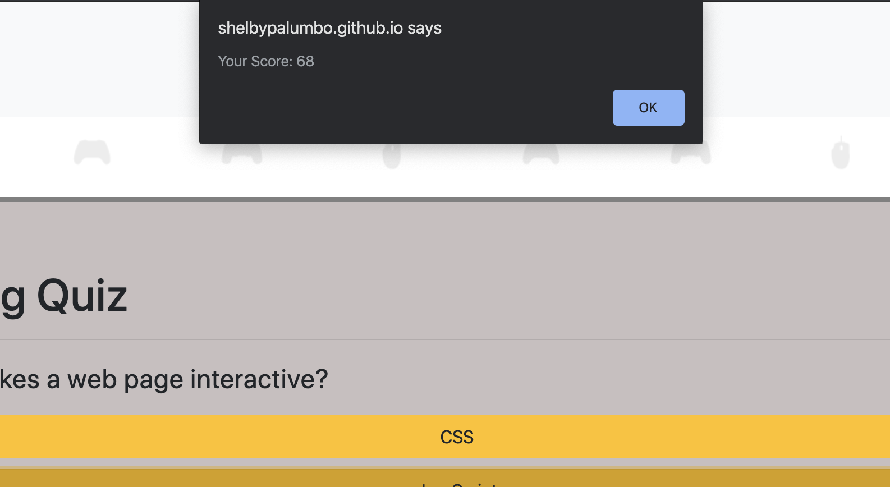

# Code-Quiz
https://shelbypalumbo.github.io/Code-Quiz/

## User Story
This a coding student, I want to test my basic knowledge of JavaScript as I move through my courses, so that I can monitor what I need to work on.

## Usage
When the quiz starts, the user will have 75 seconds to complete all 5 questions. 

If an incorrect answer is selected, the user will lose 15 seconds. If the user selects the correct answer, the time will continue to count down at the normal rate and the user will not lose or gain time. If the user does not complete all five questions in the 75 seconds, the user will not gain a score. The highscore of the user is calculated by how much time is left on the timer. If the user has 20 seconds left, that is their high score. Once the quiz is completed a prompt will appear for a username input and then an alert with the users final score.

The username input and the final score of the player will then appear under the highscores list. If the user received the highest score of all users so far, their score will appear in the left corner of the screen.

### Programming Languages Used
* HTML
* CSS
* JavaScript