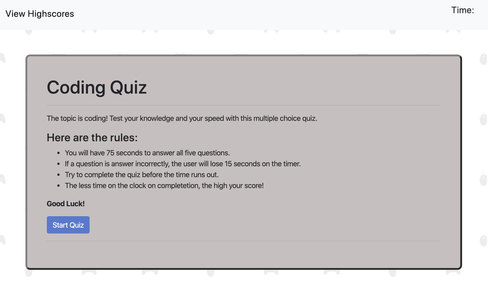

# Code-Quiz
https://shelbypalumbo.github.io/Code-Quiz/

## User Story
This repository contains the files for a timed coding quiz game application.

## Usage
Upon start of the quiz, the user will have 75 seconds to complete all 5 questions. 

If an incorrect answer is selected, the user will lose 15 seconds. If the user selects the correct answer, the time will continue to count down at the normal rate and the user will not lose or gain time. If the user does not complete all five questions in the 75 seconds, the user will not gain a score. The highscore of the user is calculated by how much time is left on the timer. If the user has 20 seconds left, that is their high score. The highscore.html page is where the user can log their name and time!

### Programming Languages Used
* HTML
* CSS
* JavaScript